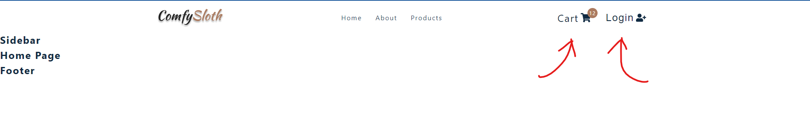

# Comfy Sloth

## Description

Here, you can find my own e-commerce project. I'm creating it using the React JS framework.
Why React? Because it's currently the most popular JS framework and it allows me to build a great SPA (single-page application). The entire project is constructed using components (small pieces of the app), which makes it very easy for me to create a nice e-commerce project.

## Changes

1. Add Router

2. Create Navbar
   

3. Create Cart Buttons
   

4. Create Footer
   

5. Create Sidebar
   

6. Product Context Setup

7. Sidebar Toggle

8. Error Page
   

9. About Page
   

10. Home Page - Hero
    

11. Home Page - Services
    

12. Home Page - Contact
    

13. Home Page - Featured Products
    
